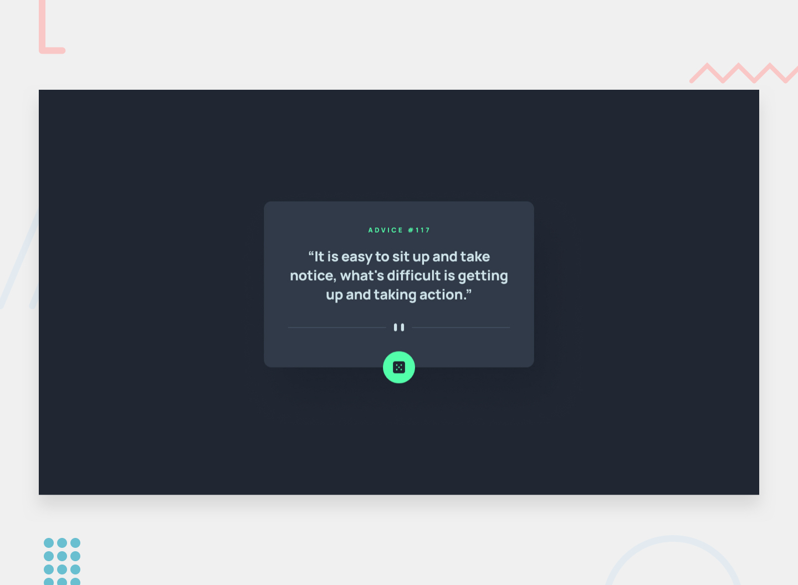

# Advice Generator App

This is a solution to the [Advice generator app challenge on Frontend Mentor](https://www.frontendmentor.io/challenges/advice-generator-app-QdUG-13db).

## Table of contents

- [Overview](#overview)
  - [The challenge](#the-challenge)
  - [Screenshot](#screenshot)
  - [Links](#links)
- [My process](#my-process)
  - [Built with](#built-with)
  - [What I learned](#what-i-learned)
  - [Continued development](#continued-development)

## Overview

### The challenge

Users should be able to:

- View the optimal layout for the app depending on their device's screen size
- See hover states for all interactive elements on the page
- Generate a new piece of advice by clicking the dice icon

### Screenshot



<p align="center">

</p>

### Links

- Live URL on [CodeSanbox.io](https://codesandbox.io/s/advice-generator-kstdo5)

## My process

_Since this was a pretty basic project, I just used React without needing any additonal libraries outside of styling._

### Built with

- [React](https://reactjs.org/) - JS library
- [Styled Components](https://styled-components.com/) - For styling

### What I learned

I did some work with `async/await` for this project. I opted to use the `try`/`catch` pattern to fetch.

```js
const [slip, setSlip] = useState(initialState);

const fetchData = async () => {
  try {
    const response = await fetch(url);
    const json = await response.json();
    setSlip(json.slip);
  } catch (error) {
    console.log("error", error);
  }
};

useEffect(() => {
  fetchData();
}, []);
```

The following is an example of some styling using styled-components:

```js
const DiceButton = ({ onClickCallback, className }) => {
  return (
    <div className={className} onClick={onClickCallback}>
      <DiceSVG />
    </div>
  );
};

const StyledDiceButton = styled(DiceButton)`
  background: #53ffaa;
  box-shadow: 0px 4px 4px 0px #00000040;
  width: 64px;
  height: 64px;
  border-radius: 50%;
  display: flex;
  flex-direction: row;
  justify-content: center;
  align-content: center;
  align-items: center;
  position: absolute;
  left: 45%;
  bottom: -24px;
  cursor: pointer;

  &:hover {
    box-shadow: 0px 0px 40px #53ffaa;
  }
`;
```

### Continued development

The rewuirements for this project were pretty simple, but I can see some areas that would benefit from further attention. New advice should be rendered with some level of animation (even just fading in). The status of the API request should be reflected by enum values with tie-ins to the UI to indicate status to the user. I am looking forward to getting deeper with async operations within react and eventually working with [React Query](https://react-query-v3.tanstack.com/).
